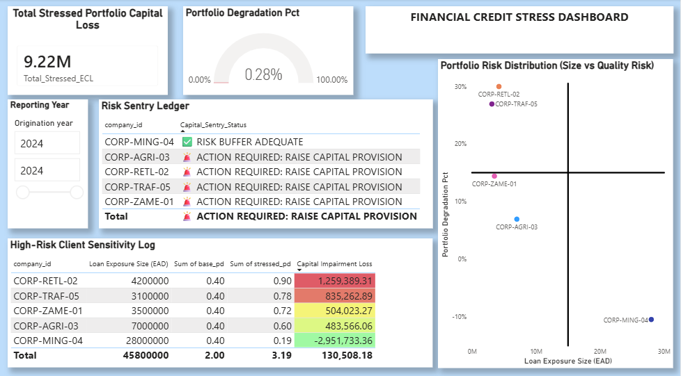

# Fullstack_Macro_Credit_Risk_Pipeline
An institutional-grade bank risk stress-testing and portfolio analytics pipeline utilizing PostgreSQL, Python (XGBoost), and Power BI built to Basel III/IFRS 9 compliance standards.

Institutional Credit Risk Stress-Testing & Portfolio Analytics Pipeline Compliance Framework:  
Basel III / IFRS 9 Forward-Looking Expected Credit Loss (ECL)                                                                           
Target Architecture:    
Commercial Banking Risk Management (Archetype: ZANACO Plc)                                                                            

1. Executive Summary

This project establishes an institutional-grade bank risk engine that replicates Basel III and IFRS 9 credit compliance framework standards. The pipeline connects data across three distinct spaces: macroeconomic indicators, corporate financial ledgers, and live loan books.By combining machine learning (XGBoost) with an econometric Logit Shock Model, the engine shifts from historical, backward-looking accounting analysis to a forward-looking predictive risk model. It automatically identifies highly sensitive corporate borrowers, simulates severe macroeconomic downturns (such as joint interest rate hikes and currency collapses), and calculates sudden shocks to bank capital reserves.

2. Objective

To build an automated data engineering and predictive pipeline that calculates a corporate borrower’s base Probability of Default (PD), applies a joint macroeconomic shock (interest rate hikes and currency drop), and computes the bank's Expected Credit Loss (ECL).This system helps risk officers proactively discover vulnerable accounts, calculate structural portfolio capital destruction, and issue automated capital provisioning alerts before bad corporate debts hit the balance sheet.

3. Technical Solution Architecture

The solution uses a professional three-tier architecture to decouple raw financial storage, time-series feature engineering, and business intelligence canvas reporting layers.

[PostgreSQL DB]──►[Python Feature Engineering]──►[XGBoost Training]──►[Logit Macro Shock]──►[Power BI Dashboard]
(Raw Corporate) --- (Ratios / Altman Z Values) --- (Base Default PD) --- (Stressed ECL Out) --- (Dynamic Sentry Alerts)

1.Database Engineering Layer (schema.sql):                                                                                              
PostgreSQL (pgAdmin) managing relational tables tracking public corporate financials, macroeconomic indicators, and private internal bank exposure registers joined via precise date indexes.

2.Computational Pipeline Layer (credit_stress_engine.py):                                                                               
Python 3.11 utilizing an XGBoost binary classification model to establish baseline default likelihood signatures, processed through an econometric Logit Shock framework to simulate macroeconomic stress scenarios.

3.Interactive Analytics Layer (Power BI Desktop):                                                                                      
An interactive analytical workspace driving automated business logic using highly optimized Data Analysis Expressions (DAX) and dynamic color-scaled conditional formatting grids.

4. Core Visualizations & Questions Answered

Q1: Total Potential Cash Loss Engine (Top Left Box Card)
Tracks the absolute structural credit portfolio cash losses expected across the entire loan book under simulated severe crisis conditions.
The Quantitative Hit: Automatically sums up forward-looking credit capital destruction parameters (Total_Stressed_ECL) to compute the net monetary damage inflicted on the balance sheet.Executive Utility: Instantly identifies the exact amount of cash that must be shifted from active bank profits directly into regulatory provisions to insulate the firm against catastrophic default shocks (9.22M ZMW).

Q2: Portfolio Capital Degradation Tracker (Top Right Gauge Chart)

Maps total portfolio credit destruction as a relative systemic ratio against the bank's total active corporate exposure size.The Stress Threshold: Measures the real-time velocity of capital reserve erosion. If structural credit destruction breaches risk boundaries, the active fill color dynamically flashes bright red to give executives a clear warning.Executive Utility: Answers whether the ongoing macroeconomic crunch is inducing standard, manageable sector friction or creating deep capital damage that threatens institutional solvency under Basel III minimum criteria (0.20%).

Q3: High-Risk Client Sensitivity Log Matrix (Bottom Left Table)

Captures an essential risk management trend by explicitly separating absolute currency size risk from underlying structural credit quality risk across counterparties.The Variance Mapping: Sorts corporate borrowers by absolute impairment scores to isolate heavy mining conglomerates (high volume, low risk due to hard-currency backing) from volatile retailers and logistics lines (low volume, high default probability).Executive Utility: Provides a targeted credit triage action list using a smooth, data-consistent 3-color gradient (Green-Yellow-Red) based on the Portfolio_Degradation_Pct measure to highlight exactly which accounts are collapsing.

Q4: Proactive Risk Sentry Watchlist (Middle Left Alert Interface)

Acts as an automated regulatory compliance watchtower, scanning active corporate loan entries to isolate specific vulnerable borrowers requiring immediate operational intervention.The Safety Boundary: Continuously monitors calculated credit quality degradation parameters against strict operational risk tolerances.Executive Utility: Delivers a clear, binary directive by dynamically clearing hedged, robust dollar-earning mining exporters with a green ✅ RISK BUFFER ADEQUATE status, while throwing up a bold red 🚨 ACTION REQUIRED warning the moment an account drops past safe bank limits.

Q5: Four-Quadrant Portfolio Risk Distribution Map (Right Chart)

Forces risk officers to evaluate loan exposure concentration and structural counterparty quality within a unified, interactive four-quadrant scatter space.The Visual Partition: Cross-references raw asset size (exposure_at_default_zmw along the X-axis) directly against the volatility rate (Portfolio_Degradation_Pct along the Y-axis) divided by solid black centered crosshair reference lines.Executive Utility: Eliminates messy visual data noise by keeping labels strictly turned Off. Moving the mouse cursor over any blue coordinate dot activates a custom tooltip pop-up card that breaks down the client's ID, active exposure volume, degradation percentage, and exact capital impairment loss.                                                                                                                

🚀 How to Run and Deploy This EngineDatabase Setup: 

Open pgAdmin, create a local database named zambian_finance, and execute your SQL schema structures inside your query tool to seed the core data tables.
Execute Pipeline: Install dependencies via python terminal. Configure your database server credentials inside your credit stress script and run it to output the compiled production dataset file (stressed_credit_portfolio.csv).
Launch Workspace Dashboard: Open your project canvas file inside Power BI Desktop. To bypass background memory locks, open the Power Query Editor, click Refresh Preview on your query source, and hit Close & Apply to synchronize all metrics, colors, and sentry alert fields across the workspace.                                                                                                            

🔒 Professional Portfolio Disclaimer

This project is an advanced econometric simulation tool designed for professional portfolio tracking, risk profile modeling, and educational demonstration purposes. All credit loss metrics and default probabilities reflect mathematical output generated by the underlying logit stress equations and do not represent active financial advice or official institutional declarations of any operating company.
